# Lamp-Stack-Implementation

> This is a project which implement the use of Web Stack (LAMP STACK) In AWS

What is a Technology stack?

A technology stack is a set of frameworks and tools used to develop a software product. This set of frameworks and tools are very specifically chosen to work together in creating a well-functioning software. They are acronymns for individual technologies used together for a specific technology product. some examples are…

LAMP (Linux, Apache, MySQL, PHP or Python, or Perl)
LEMP (Linux, Nginx, MySQL, PHP or Python, or Perl)
MERN (MongoDB, ExpressJS, ReactJS, NodeJS)
MEAN (MongoDB, ExpressJS, AngularJS, NodeJS


## Built With

- Linux
- AWS cloud

    ### Prerequisites

    `linux and a little knowledge of aws`


  ## Getting Started && Setup

                       ### Create a EC2 Instance 
- Select region (the cl and launch a new EC2 instance of t2.micro family with Ubuntu Server 20.04 LTS (HVM)
- Create a pair Key as the EC2 is created 
- Move into the folder where the pair key is downloaded and run the following command to connect to the instance.
       
        sudo chmod 0400 <private-key-name>.pem
        ssh -i <private-key-name>.pem ubuntu@<Public-IP-address>                           

   ###  Install APACHE and Update the Firewall

    <sub> Firat is to update a list of packages in package manager, the following command is used

                     sudo apt update

- Then we run apache2 package installation using the following command
                
                     sudo apt install apache2
                
- To verify that apache2 is running as a Service in our OS, use following command
         
                    sudo systemctl status apache2
         
- we can try to check how we can access it locally in our Ubuntu shell, using the following command
                 curl http://localhost:8080
        
                                   or
                    
                      curl http://127.0.0.1:8080
             
    </sub>

     > ***The image below will be display with the ip address***


# MySQL
## Installing MySQL on the virtual environment

Congratulations on setting up and running your Apache web server. Next, we will install MySQL, which is an open-source relational database management system. This will allow us to store and manage data for the website.

Begin by using the following command to install MySQL:

```
$ sudo apt install mysql-server
```

When prompted, confirm that you want to proceed with the installation by typing `Y` for "Yes", and then press "Enter" on your Keyboard.

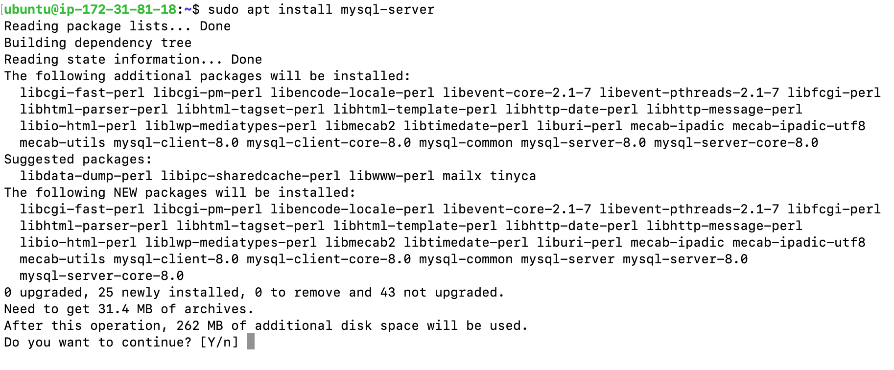

Once the installation is complete, it is best practice to   run a security script in order to add more security access to your database system. Use the following command:

```
$ sudo mysql_secure_installation
```

You will be asked to validate password component. Type `Y` for "Yes". 

Next, you must choose the level of your password validation. There are three levels of password validation policy:

Please choose either `0` = LOW, `1` = MEDIUM or `2` = STRONG

**Please Note:**

`LOW` --- Length >= 8

`MEDIUM` --- Length >= 8, numeric, mixed case, **and** special characters

`STRONG` --- Length >= 8, numeric, mixed case, special characters **and** dictionary file

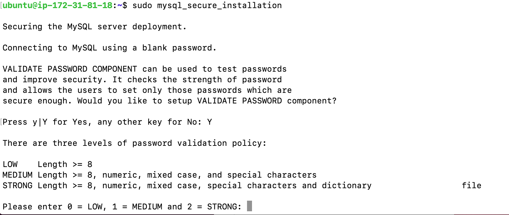

Once you are satisfied with your password, enter it then type `Y` for “Yes” when asked if you want to continue with the password provided.

For the rest of the questions, type `Y` for "Yes" and press "Enter" on your keyboard at each prompt. 

These security measures will remove anonymous users and the test database, disable remote root logins, and then reload these new rules so that the changes will be reflected on the MySQL database. 

Your Terminal should look something like this:

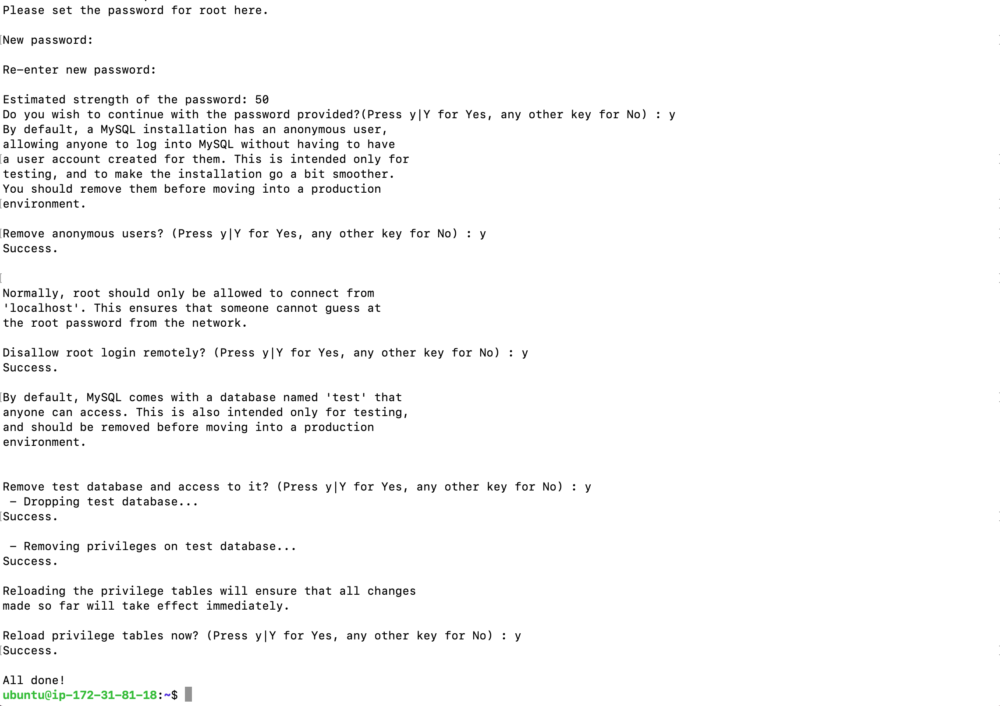

Next, you can check whether you can log in to the MySQL console by typing the following command. This command allows you to connect to the MySQL server as the administrative user (root user), which is implied by the use of 'sudo' part of the command:

```
$ sudo mysql
```

This will connect to the MySQL server as the administrative database user **root**, which is inferred by the use of sudo when running this command. You should see the following output:

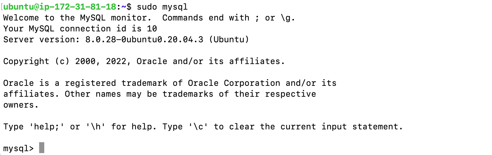

To exit the MySQL console, type the following:

```
mysql> exit
```

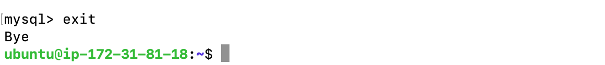


# PHP
## Installing PHP on the virtual enviornment

Congrats on making it this far! We have reached the final component of the LAMP web stack; [PHP](https://www.php.net/) is general-purpose scripting language which process code so that it can display dynamic content to the end user. 

In addition to installing **PHP**, we must install **php-mysql**, which is a PHP module that allows PHP to communicate with MySQL-based databases. We must also install **libapache2-mod-php** to allow Apache to handle PHP files. 

We can simultaneously install all three of these packages. Begin by running the following command on Terminal:

```
$ sudo apt install php libapache2-mod-php php-mysql
```

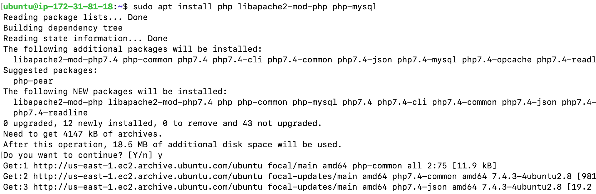

Congrats! The LAMP stack is now completely installed and fully operational.
## Creating a Virtual Host using Apache

Next, we will create a virtual host using Apache. A virtual host allows us to have multiple websites located on a single machine! This will be used to test our setup.

Begin by creating the directory for `projectlamp` using the following command:

```
$ sudo mkdir /var/www/projectlamp
```

Next, assign ownership of the directory using the following command:

```
$ sudo chown -R $USER:$USER /var/www/projectlamp
```

Next, we must create and open a new configuration file using `vi`, which is a text editor. Use the command below to open a blank file:

```
$ sudo vi /etc/apache2/sites-available/projectlamp.conf
```

Next, paste in the following  configuration by pressing on `i` on the keyboard to engage the 'insert' mode, then paste the text below:

`<VirtualHost *:80>
    ServerName projectlamp
    ServerAlias www.projectlamp 
    ServerAdmin webmaster@localhost
    DocumentRoot /var/www/projectlamp
    ErrorLog ${APACHE_LOG_DIR}/error.log
    CustomLog ${APACHE_LOG_DIR}/access.log combined
</VirtualHost>`

Once you have entered the text, press `esc`, type `:wq`, then press "Enter" on your keyboard to write (save) and exit the vi editor.

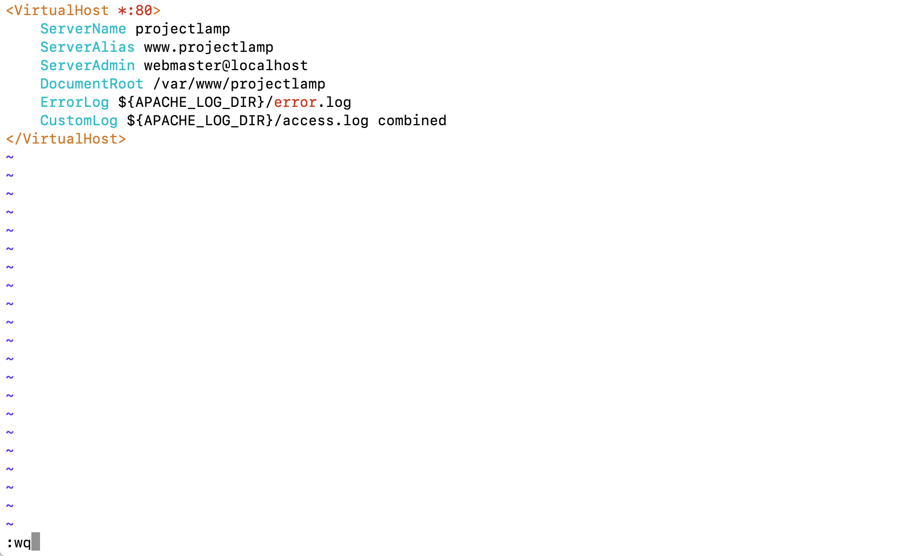

Next, we will use a series of commands.

To show the new file in the **sites-available** directory, use the following command. With this Virtua lHost configuration, we are telling Apache to serve `projectlamp` using **/var/www/projectlampl** as its web root directory.

```
$ sudo ls /etc/apache2/sites-available
```

Next, use the ***a2ensite*** command to enable the new virtual host:

```
$ sudo a2ensite projectlamp
```

You may want to disable the default website that comes installed with Apache. This is necessary if you are not using a custom domain name, because in this case Apache’s default configuration would overwrite your virtual host. 

To disable Apache’s default website use the following command:

```
$ sudo a2dissite 000-default
```

To make sure your configuration file doesn’t contain syntax errors, run:

```
$ sudo apache2ctl configtest
```

Finally, reload Apache so these changes take effect:

```
$ sudo systemctl reload apache2
```

Here is what you can expect to see on your Terminal:

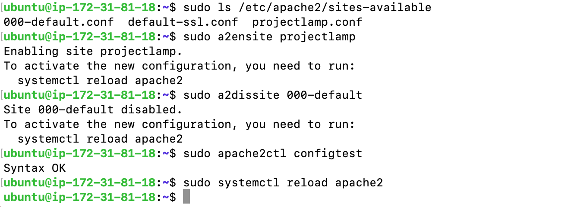

Although our website is now active, the web root **/var/www/projectlamp** is still empty. Let's create an index.html file in that location so that we will be able to test that the virtual host works properly. Use the command below:

```
sudo echo 'Hello LAMP from hostname' $(curl -s http://169.254.169.254/latest/meta-data/public-hostname) 'with public IP' $(curl -s http://169.254.169.254/latest/meta-data/public-ipv4) > /var/www/projectlamp/index.html
```

Now let's test that the website is correctly displaying our content by opening the EC2 Public IP address in your web browser. `http://<Public-IP-Address>:80` . 

It should look something like this:

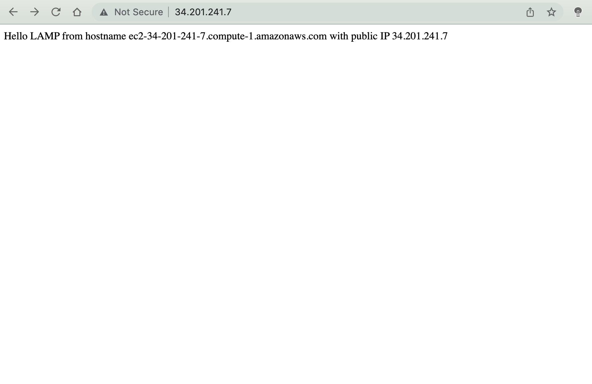

## Enable PHP on the website

Lastly, we must modify the directory index settings, such that the `index.html` no longer takes precedence over an `index.php` file. We can achieve this behavior by editing the /etc/apache2/mods-enabled/dir.conf file and then changing the order in which the `index.php file` is listed within the DirectoryIndex directive. Use the following command:

```
sudo vim /etc/apache2/mods-enabled/dir.conf
```

In the vi editor, modify the default text to the following:

<IfModule mod_dir.c>
        DirectoryIndex index.php index.html index.cgi index.pl index.xhtml index.htm
</IfModule>
:

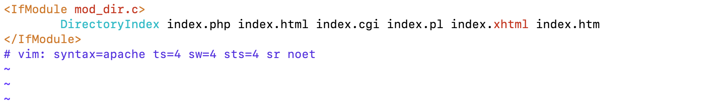

Next, after saving and closing the file, you must reload Apache so the changes take effect. Use the following command:

```
$ sudo systemctl reload apache2
```

Finally, we will create a PHP script. This will test whether or not PHP is correctly installed and configured on the server. Use the following command to create a new file named `index.php` inside your custom web root folder:

```
$ vim /var/www/projectlamp/index.php
```

This will open a blank file. Add the following text inside of the file:

```
<?php
phpinfo();
```


Once you have completed this step, save and close the file.

Refresh the page on your browser, and you will see a page similar to this (note: contents partially redacted for privacy): 

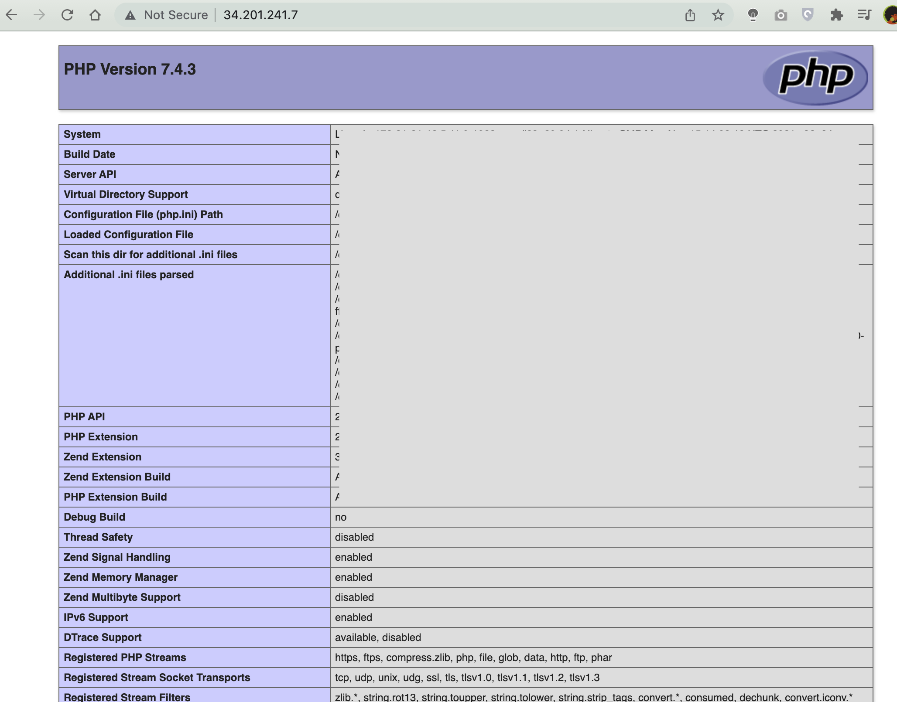


Congratulations! You did it! We have completed our LAMP Web Stack Implementation. 

Don't forget to terminate your EC2 instance and it's associated components on the AWS Console. Also, be sure to remove the file you created as it contains sensitive information using the following command:

```
$ sudo rm /var/www/projectlamp/index.php
```


## Authors

👤 **Uzoma Jesse Tochukuw**

- GitHub: [@Hedevedup](https://github.com/githubhandle)
- Twitter: [@devtochi](https://twitter.com/twitterhandle)
- LinkedIn: [jesseuzoma](https://linkedin.com/in/linkedinhandle)


## Show your support

Give a ⭐️ if you like this project!

## Acknowledgments
- Hat tip to anyone whose code was used
- Inspiration
- etc  
`thanks to Darey.io forr this dev ops schoolaship`


